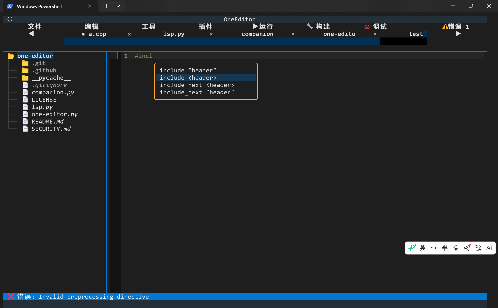
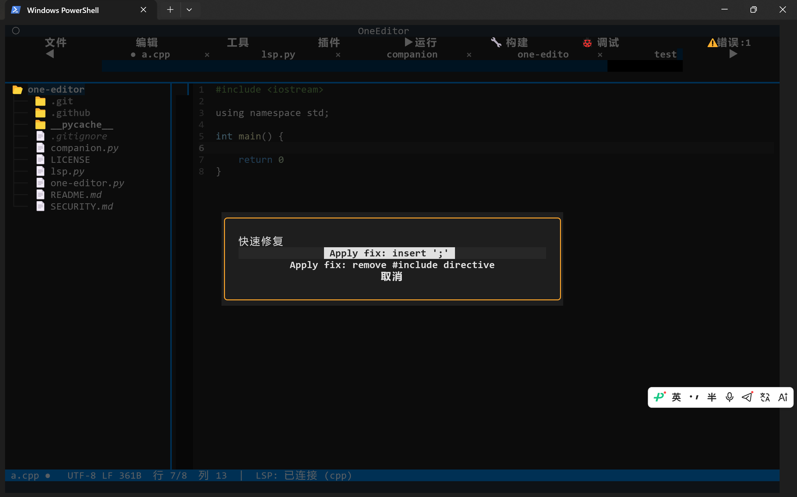
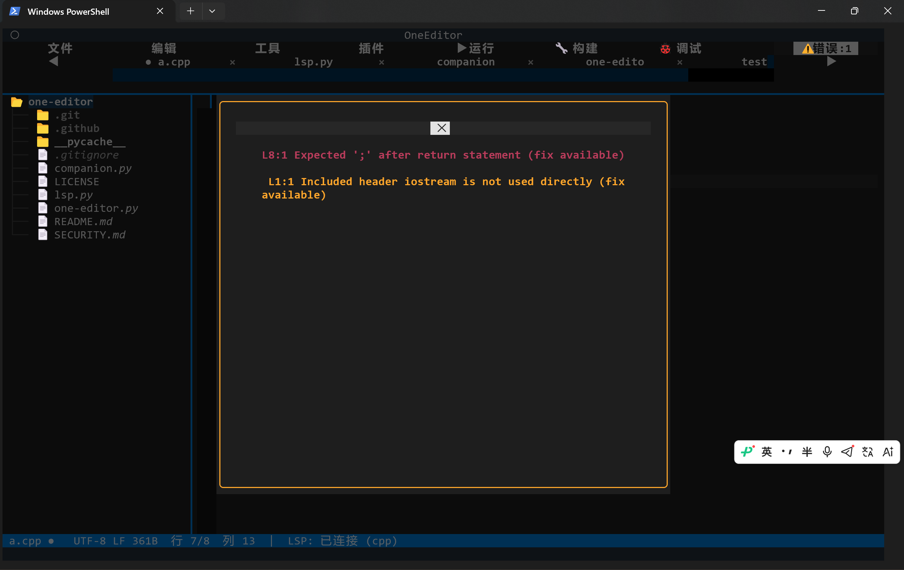

# One Editor 🚀
```
  ___                  _____    _ _ _            
 / _ \ _ __   ___     | ____|__| (_) |_ ___  _ __ 
| | | | '_ \ / _ \    |  _| / _` | | __/ _ \| '__|
| |_| | | | |  __/    | |__| (_| | | || (_) | |   
 \___/|_| |_|\___|    |_____\__,_|_|\__\___/|_|   
```
[](https://python.org)
[](https://textual.textualize.io)
[](LICENSE)


> # 因author业务调整、高中学业繁忙，**One Editor** 现已暂停维护，随缘更新，谢谢各位的关注🙏

---

**One Editor** 是一款由准高中生基于 [Textual](https://textual.textualize.io) 构建的现代化终端代码编辑器，提供接近 VSCode 的编辑体验，同时保持轻量、快速和高度可定制。

> **您好！该项目仍处于测试阶段，不正当的使用可能会产生意想不到的后果**

 
 
 

---

## ✨ 特性

- 📝 **多标签编辑** – VSCode 风格的标签栏，支持拖拽、滚动和关闭按钮
- 🌳 **文件树** – 侧边栏文件浏览，支持新建、删除、重命名、移动、复制、粘贴，并带有撤销/重做（Ctrl+Z / Ctrl+Shift+Z）
- 🔍 **LSP 集成** – 支持补全、跳转定义、悬停提示、重命名符号、代码操作、诊断（错误/警告），并自带 **Error Lens**（行内诊断）和 **Rainbow Brackets**（括号匹配高亮）
- 🖥️ **内置终端** – 完整的 Shell 终端，支持命令历史（上下键）
- 🤖 **Ollama 对话** – 集成本地 AI 助手，可直接在编辑器内提问并插入生成的代码 
  > **AI 生成的代码仅供参考**
- 📦 **插件系统** – 支持启用/禁用语言服务器和功能插件（如 Competitive Companion）
- 🛠️ **运行/构建/调试** – 一键运行 Python、JavaScript、C/C++、Go、Rust、Ruby、PHP 等语言，并支持项目构建（CMake / npm / Cargo）
- 📊 **文件对比** – 对比两个打开的标签页，显示统一差异（unified diff）
- 🎨 **命令面板** – 类似 VSCode 的命令面板（Ctrl+Shift+P），快速执行所有操作，并可切换主题
- 📸 **截图** – 一键保存当前编辑器窗口截图（Ctrl+K）
- 🌍 **多语言** – 内置中英文切换（设置面板）
  > **当前仅支持中文（简体）和英语**
- ⚙️ **可配置** – 主题、缩进、自动保存、字体大小、自动换行等

---

## 🚀 快速开始

### 安装依赖

```bash
# 克隆项目
git clone https://github.com/Aoan2011/one-editor.git
cd one-editor

# 安装 Python 依赖
pip install -r requirements.txt
```
requirements.txt 内容
```python
#MIT License

#Copyright (c) 2026 Aoan2011

textual>=0.15.0
aiohttp>=3.14.1
python-lsp-server>=1.0.0   # 或 pylsp
textual[syntax] >= 8.2.8
#ollama >= 0.6.2
```
运行
```bash
python one-editor.py
```
---
## 首次启动

程序会自动创建 ~/.one-editor/ 目录，用于存储配置文件、插件配置、打开记录等。首次启动会显示欢迎标签页，您可以开始新建文件或打开已有项目。


## ⌨️ 快捷键
| 快捷键 | 功能 |
|--------|------|
| Ctrl+N | 新建文件 |
| Ctrl+O | 打开文件 |
| Ctrl+S | 保存文件 |
| Ctrl+Shift+S | 另存为 |
| Ctrl+W | 关闭当前标签 |
| Ctrl+Q | 退出程序 |
| Ctrl+F | 查找 |
| Ctrl+H | 替换 |
| F3 | 查找下一个 |
| Ctrl+G | 转到行 |
| Ctrl+B | 切换文件树 |
| F2 | 重命名文件树节点 |
| Ctrl+Shift+M | 移动文件树节点 |
| F12 | 跳转定义 |
| Ctrl+Shift+O | 代码大纲 |
| Ctrl+Shift+I | 悬停提示 |
| Ctrl+Shift+R | 重命名符号 |
| Ctrl+Shift+A | 快速修复 |
| Ctrl+Shift+F | 格式化文档 |
| Ctrl+A | 全选 |
| F5 | 运行当前文件 |
| F6 | 构建项目 |
| F7 | 调试（Python） |
| Ctrl+Z | 撤销文件树操作 |
| Ctrl+Shift+Z | 重做文件树操作 |
| Ctrl+` | 打开/关闭终端 |
| Ctrl+L | 清空终端 |
| Ctrl+Shift+P | 命令面板 |
| Ctrl+D | 文件对比（两个标签） |
| Ctrl+Shift+O | 打开 Ollama 面板 |
| Ctrl+K | 截图 |

## 🧩 插件与语言服务器
### 内置语言支持
| 语言 | 服务器 | 备注 |
|------|--------|------|
| Python | pylsp | 需安装 `python-lsp-server` |
| JavaScript/TypeScript | typescript-language-server | 需 ```npm i -g typescript-language-server``` |
| C/C++ | clangd | 需安装 `LLVM / clangd` |
| Java | jdtls | 需下载 `Eclipse JDT LS` |
| Go | gopls | 需 ```go install golang.org/x/tools/gopls@latest``` |
| Rust | rust-analyzer | 需安装 rust-analyzer |
| Ruby | solargraph | 需 ```gem install solargraph``` |
| PHP | intelephense | 需 ```npm i -g intelephense``` |

>  **请确保你的lsp已被添加到PATH**

## Competitive Companion
启用后，编辑器会在本地 10045 端口监听 HTTP POST 请求，接收来自 Competitive Companion 浏览器扩展的题目数据，自动生成代码文件和测试用例。

# ⚙️ 配置
设置文件位于 `~/.one-editor/state.json`，您也可以直接在编辑器内通过「工具 → 设置」修改。

## 可配置项
- `theme`: textual-dark / textual-light / dracula / nord / ansi-dark / ansi-light
- `indent_width`: 缩进空格数（默认为 4）
- `show_line_numbers`: 是否显示行号
- `autosave_interval`: 自动保存间隔（秒），0 表示关闭
- `language`: zh 或 en
- `wrap`: 自动换行
- `indent_type`: spaces 或 tabs
- `default_dir`: 默认项目目录（用于 Companion 等）
- `ollama_url`: Ollama API 地址（默认 http://localhost:11434）
- `ollama_model`: 使用的模型（默认 gpt-oss:20b-cloud）

## 📁 项目结构
```
one-editor/
├── one-editor.py # 主程序
├── lsp.py # LSP 客户端封装
├── companion.py # Competitive Companion 服务器
├── requirements.txt # 依赖
└── README.md
```

## 已知问题
- 部分按钮被遮挡
- 调试仅支持Python（PDB）
## 未来路线
```
1.0.x
─────┬──────────┬────────────────────────────┬───────────────────────────┬───────────────────────►
     │ Jul 2026 │ Aug 2026                   │ Sep 2026 — Dec 2026 / 2027│ Post‑2027
     │Pre‑release│ Bug‑Fix                   │ Long‑term Bug‑Fix Maintenance │ End‑of‑Support
     └──────────┴────────────────────────────┴───────────────────────────┴───────────────────────┘


1.1.x (TBD, unconfirmed schedule)
───────────────────────────────┬──────────────────┬──────────────────┬───────────────────────►
                               │ CY 2027          │ + 2 calendar months │ After maintenance window
                               │ Pre‑release      │ Bug‑Fix Phase    │ End‑of‑Support
                               └──────────────────┴──────────────────┴───────────────────────┘

Legend:
  Pre‑release    : Feature‑complete pre‑release builds, for early testing
  Bug‑Fix        : Only bug & security patches, no new feature development
  End‑of‑Support : No further updates, fixes or security patches
```
## 🤝 贡献

欢迎提交 Issue 和 Pull Request。请确保代码符合 PEP8，并包含适当的注释。
## 📄 许可证

MIT 想干什么干什么
## 🙏 致谢

>    Textual – 强大的 TUI 框架

 >   Python LSP Server

  >  所有语言服务器的开发者

## 🌟Star History
<a href="https://www.star-history.com/?repos=Aoan2011%2FOne-Editor&type=timeline&legend=top-left">
 <picture>
   <source media="(prefers-color-scheme: dark)" srcset="https://api.star-history.com/chart?repos=Aoan2011/One-Editor&type=timeline&theme=dark&legend=top-left&sealed_token=lk1ftLhnXQnPWsroyelK6zDsfPPeOLbPteST0xznVh5YAo3eiSnh-cu1wahiKzPJYoxSlGlyrrMsLR9-ig4NdpNu0E8SO7qeTAClLLUHfnj2veSpRSjZnw" />
   <source media="(prefers-color-scheme: light)" srcset="https://api.star-history.com/chart?repos=Aoan2011/One-Editor&type=timeline&legend=top-left&sealed_token=lk1ftLhnXQnPWsroyelK6zDsfPPeOLbPteST0xznVh5YAo3eiSnh-cu1wahiKzPJYoxSlGlyrrMsLR9-ig4NdpNu0E8SO7qeTAClLLUHfnj2veSpRSjZnw" />
   
 </picture>
</a>

---

# Buy me a coffee

 
