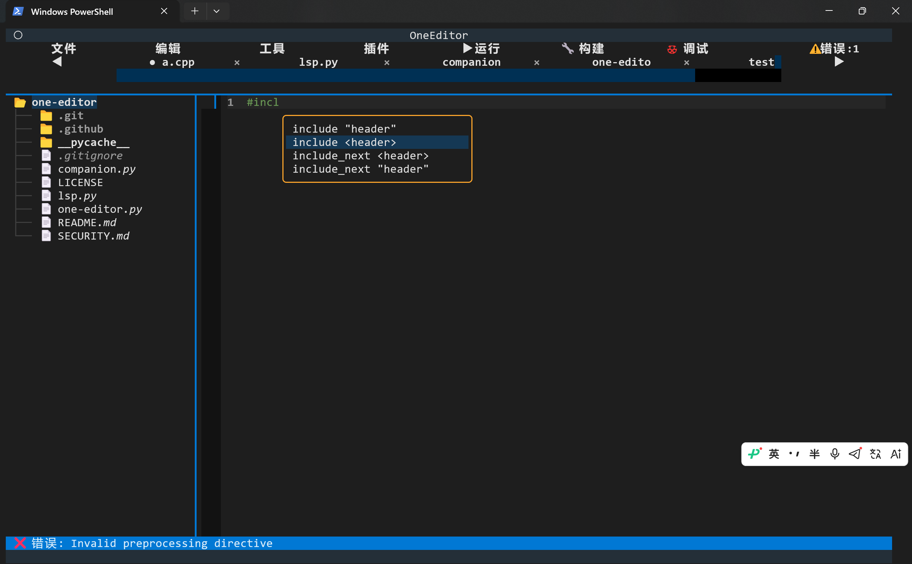
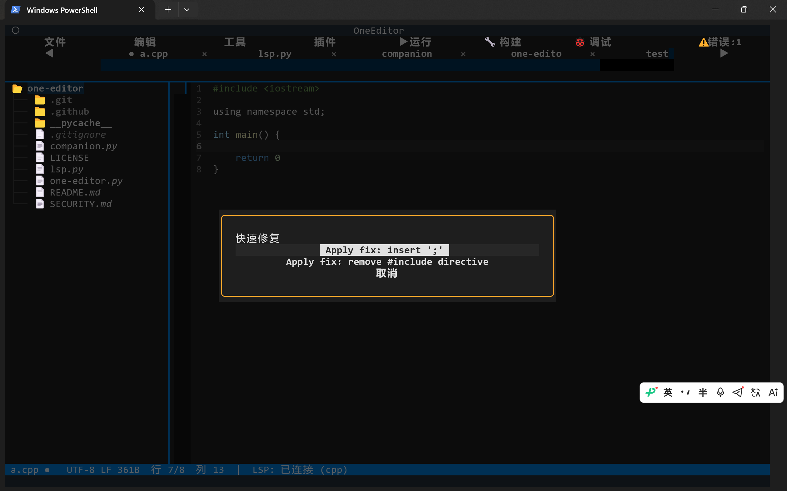
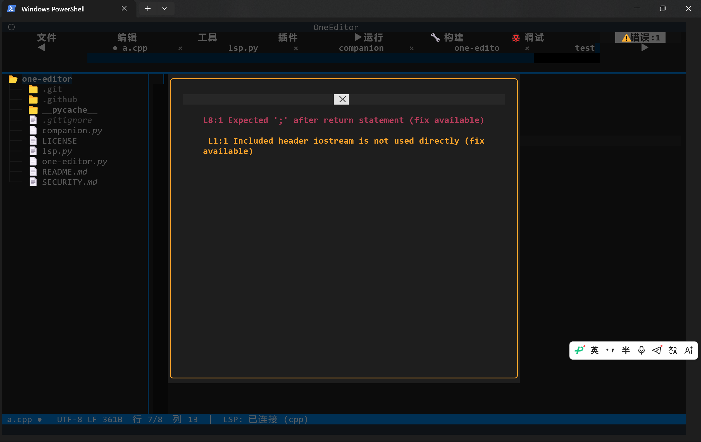

# One Editor 🚀
```
  ___                  _____    _ _ _            
 / _ \ _ __   ___     | ____|__| (_) |_ ___  _ __ 
| | | | '_ \ / _ \    |  _| / _` | | __/ _ \| '__|
| |_| | | | |  __/    | |__| (_| | | || (_) | |   
 \___/|_| |_|\___|    |_____\__,_|_|\__\___/|_|   
```
[](https://python.org)
[](https://textual.textualize.io)
[](LICENSE)


> # 因author业务调整、高中学业繁忙，自2026年08月07日暂停维护**One Editor**，随缘更新，谢谢各位的关注🙏


---

**One Editor** 是一款由准高中生基于 [Textual](https://textual.textualize.io) 构建的现代化终端代码编辑器，提供接近 VSCode 的编辑体验，同时保持轻量、快速和高度可定制。

> **您好！该项目仍处于测试阶段，不正当的使用可能会产生意想不到的后果**

 
 
 

---

## ✨ 特性

- 📝 **多标签编辑** – VSCode 风格的标签栏，支持拖拽、滚动和关闭按钮
- 🌳 **文件树** – 侧边栏文件浏览，支持新建、删除、重命名、移动、复制、粘贴，并带有撤销/重做（Ctrl+Z / Ctrl+Shift+Z）
- 🔍 **LSP 集成** – 支持补全、跳转定义、悬停提示、重命名符号、代码操作、诊断（错误/警告），并自带 **Error Lens**（行内诊断）和 **Rainbow Brackets**（括号匹配高亮）
- 🖥️ **内置终端** – 完整的 Shell 终端，支持命令历史（上下键）
- 🤖 **Ollama 对话** – 集成本地 AI 助手，可直接在编辑器内提问并插入生成的代码 
  > **AI 生成的代码仅供参考**
- 📦 **插件系统** – 支持启用/禁用语言服务器和功能插件（如 Competitive Companion）
- 🛠️ **运行/构建/调试** – 一键运行 Python、JavaScript、C/C++、Go、Rust、Ruby、PHP 等语言，并支持项目构建（CMake / npm / Cargo）
- 📊 **文件对比** – 对比两个打开的标签页，显示统一差异（unified diff）
- 🎨 **命令面板** – 类似 VSCode 的命令面板（Ctrl+Shift+P），快速执行所有操作，并可切换主题
- 📸 **截图** – 一键保存当前编辑器窗口截图（Ctrl+K）
- 🌍 **多语言** – 内置中英文切换（设置面板）
  > **当前仅支持中文（简体）和英语**
- ⚙️ **可配置** – 主题、缩进、自动保存、字体大小、自动换行等
- 📄 **文件预览** – 支持 Markdown 和 HTML 文件在系统浏览器中预览
- ☁️ **Git支持** - 支持 Git 操作、文件树显示 Git 文件状态等
  > **需要在 Git 文件夹中**
---

## 🚀 快速开始

### 安装方法1 （推荐 Windows/macOS/Linux）

```bash
# 克隆项目
git clone https://github.com/Aoan2011/one-editor.git
cd one-editor

#运行
python one-editor.py
```
### 安装方法2 （Windows）
前往 [Realease](https://github.com/Aoan2011/One-Editor/release) 上下载二进制文件

## 首次启动

程序会自动创建 ~/.one-editor/ 目录，用于存储配置文件、插件配置、打开记录等。首次启动会显示欢迎标签页，您可以开始新建文件或打开已有项目。


## ⌨️ 快捷键
| 快捷键 | 功能 |
|--------|------|
| Ctrl+N | 新建文件 |
| Ctrl+O | 打开文件 |
| Ctrl+S | 保存文件 |
| Ctrl+Shift+S | 另存为 |
| Ctrl+W | 关闭当前标签 |
| Ctrl+Q | 退出程序 |
| Ctrl+F | 查找 |
| Ctrl+H | 替换 |
| F3 | 查找下一个 |
| Ctrl+G | 转到行 |
| Ctrl+B | 切换文件树 |
| F2 | 重命名文件树节点 |
| Ctrl+Shift+M | 移动文件树节点 |
| F12 | 跳转定义 |
| Ctrl+Shift+O | 代码大纲 |
| Ctrl+Shift+I | 悬停提示 |
| Ctrl+Shift+R | 重命名符号 |
| Ctrl+Shift+A | 快速修复 |
| Ctrl+Shift+F | 格式化文档 |
| Ctrl+A | 全选 |
| F5 | 运行当前文件 |
| F6 | 构建项目 |
| F7 | 调试（Python） |
| Ctrl+Z | 撤销文件树操作 |
| Ctrl+Shift+Z | 重做文件树操作 |
| Ctrl+` | 打开/关闭终端 |
| Ctrl+L | 清空终端 |
| Ctrl+Shift+P | 命令面板 |
| Ctrl+D | 文件对比（两个标签） |
| Ctrl+Shift+O | 打开 Ollama 面板 |
| Ctrl+K | 截图 |

## 🧩 插件与语言服务器
### 内置语言支持
| 语言 | 服务器 | 备注 |
|------|--------|------|
| Python | pylsp | 需安装 `python-lsp-server` |
| JavaScript/TypeScript | typescript-language-server | 需 ```npm i -g typescript-language-server``` |
| C/C++ | clangd | 需安装 `LLVM / clangd` |
| Java | jdtls | 需下载 `Eclipse JDT LS` |
| Go | gopls | 需 ```go install golang.org/x/tools/gopls@latest``` |
| Rust | rust-analyzer | 需安装 `rust-analyzer` |
| Ruby | solargraph | 需 ```gem install solargraph``` |
| PHP | intelephense | 需 ```npm i -g intelephense``` |

>  **请确保你的lsp已被添加到PATH**

## Competitive Companion
启用后，编辑器会在本地 10045 端口监听 HTTP POST 请求，接收来自 Competitive Companion 浏览器扩展的题目数据，自动生成代码文件和测试用例。

# ⚙️ 配置
设置文件位于 `~/.one-editor/state.json`，您也可以直接在编辑器内通过「工具 → 设置」修改。

## 可配置项
- `theme`: textual-dark / textual-light / dracula / nord / ansi-dark / ansi-light
- `indent_width`: 缩进空格数（默认为 4）
- `show_line_numbers`: 是否显示行号
- `autosave_interval`: 自动保存间隔（秒），0 表示关闭
- `language`: zh 或 en
- `wrap`: 自动换行
- `indent_type`: spaces 或 tabs
- `default_dir`: 默认项目目录（用于 Companion 等）
- `ollama_url`: Ollama API 地址（默认 http://localhost:11434）
- `ollama_model`: 使用的模型（默认 gpt-oss:20b-cloud）

## 📁 项目结构
```
one-editor/
├── one-editor.py # 主程序
├── lsp.py # LSP 客户端封装
├── companion.py # Competitive Companion 服务器
├── requirements.txt # 依赖
└── README.md
```

### Git 状态符号表

| 符号 | 含义 |
|------|------|
| `?` | 未跟踪（Untracked） |
| `M` | 已修改（Modified） |
| `A` | 已暂存（Added） |
| `D` | 已删除（Deleted） |
| `R` | 已重命名（Renamed） |
| `U` | 冲突（Conflict） |
| `·` | 已跟踪但无变更（Clean） |

> 状态标记显示在文件树中，格式为 `Git:<符号> <短哈希>`，例如 `Git:? <a1b2c3d>`。

## 命令行说明
``` bash
# 打开单个文件
python one-editor.py /path/to/file.py

# 打开多个文件（会分别创建标签页）
python one-editor.py main.py README.md

# 打开目录（文件树会自动切换到该目录）
python one-editor.py /home/user/project

# 同时打开文件和目录
python one-editor.py /home/user/project /home/user/project/main.py
```
## 插件设置格式
| 变量 | 说明 | 示例 |
|------|------|------|
| `{FilePath}` | 当前文件的完整绝对路径 | `/home/user/project/main.py` |
| `{FilePathWithNoExtension}` | 去掉扩展名的完整路径 | `/home/user/project/main` |
| `{FileName}` | 文件名（含扩展名） | `main.py` |
| `{FileNameWithNoExtension}` | 文件名（不含扩展名） | `main` |
| `{DirPath}` | 文件所在目录的绝对路径 | `/home/user/project` |

## 已知问题
- 性能较差
- UI待改进
## 🤝 贡献

欢迎提交 [Issues](https://github.com/Aoan2011/One-Editor/issues) 和 [Pull Requests](https://github.com/Aoan2011/One-Editor/pulls)。请确保代码符合 PEP8，并包含适当的注释。
## 📄 许可证

MIT 想干什么干什么
## 🙏 致谢

>    Textual – 强大的 TUI 框架

 >   Python LSP Server

  >  所有语言服务器的开发者

## 🌟Star History
## Star History

<a href="https://www.star-history.com/?repos=Aoan2011%2FOne-Editor&type=date&legend=top-left">
 <picture>
   <source media="(prefers-color-scheme: dark)" srcset="https://api.star-history.com/chart?repos=Aoan2011/One-Editor&type=date&theme=dark&legend=top-left&sealed_token=qhb-GtF6Vq3beQ5n23YultNPiKJDLjpHS8-SkT5efVdkY_fTIs5IkSE9AgHhWwqEXI6uzv4X7P8qia7saaWliuS_-7ZOZtksOKaSkHwyLH0eqJlJj7to4w" />
   <source media="(prefers-color-scheme: light)" srcset="https://api.star-history.com/chart?repos=Aoan2011/One-Editor&type=date&legend=top-left&sealed_token=qhb-GtF6Vq3beQ5n23YultNPiKJDLjpHS8-SkT5efVdkY_fTIs5IkSE9AgHhWwqEXI6uzv4X7P8qia7saaWliuS_-7ZOZtksOKaSkHwyLH0eqJlJj7to4w" />
   
 </picture>
</a>

---

# Buy me a coffee

 
